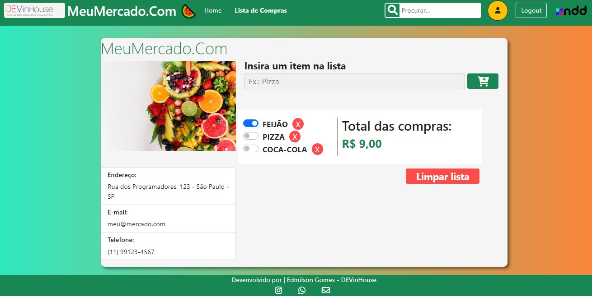

# Projeto 01 - Módulo 01  - DEVinHouse - Turma NDD
## Projeto desenvolvido para o curso DEVinHouse - Turma NDD 🚀

<h2>🛠️ Tecnologias Usadas</h2>  
<ul>
    <li>HTML5</li>
    <li>CSS3</li>
    <li>JavaScript</li>
    <li>BootStrap</li>
</ul>

<h2>📦 Resultados de Desenvolvimento</h2>

* Implementação da interface com HTML, CSS, Bootstrap;
* Função de receber item inserido na lista;
* Função de excluir item da lista;
* Botão de dar Check no item da lista;
* Modal que se abre para colocar valor no item;
* Valor esse que é salvo e somado ao valor total;
* Função de salvar lista no LocalStore;
* Função que recebe o que ficou salvo no LocalStore;
* Função de retorno à tela do que ficou salvo no LocalStore;
* Mantendo os valores e itens checados;
* Botão que limpa item salvo em LocalStore;

<h2>✒️Autor</h2>
<h3>Edmilson Gomes 😊</h3>
